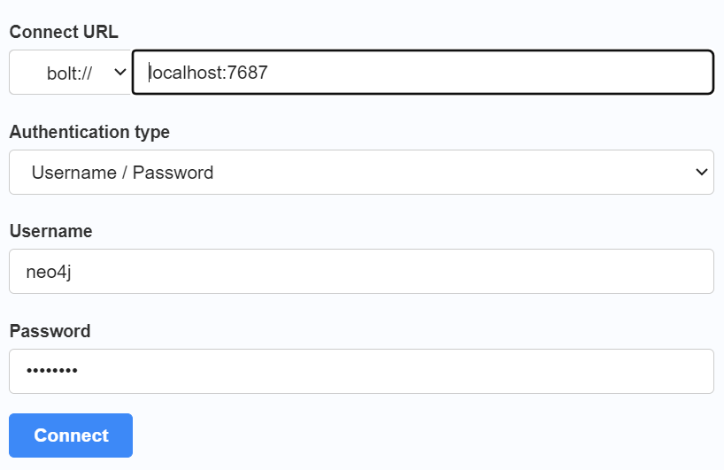

# <p align="center">Neo4j</p>

It is a high performance graph store with all the features expected of a mature and robust database, like a friendly
query language and ACID transactions. For more information refer
to [https://github.com/neo4j/neo4j](https://github.com/neo4j/neo4j)

# Use Case

List of use cases for Neo4j
[https://go.neo4j.com/rs/710-RRC-335/images/Neo4j-Top-10-Use-Cases-EN-US.pdf](https://go.neo4j.com/rs/710-RRC-335/images/Neo4j-Top-10-Use-Cases-EN-US.pdf).

* Fraud Detection
* Real-Time Recommendation Engine
* Knowledge Graphs
* Anti-Money Laundering
* Master Data Management
* Supply Chain Management
* Empowering Network & IT Operations Management 14
* Data Lineage
* Identity & Access Management
* Bill of Materials

# Setup

## Prerequisites

* [Docker](https://www.docker.com/)
* [Kubernetes](https://kubernetes.io/)

## Installation Neo4j on Docker

### Docker Compose File

Create a docker compose file include following content.

[docker-compose.yml](docker-compose.yml)

```yaml
# docker-compose.yml
version: '3.8'

services:
  neo4j:
    image: neo4j
    container_name: neo4j
    hostname: neo4j
    ports:
      - "7474:7474"
      - "7687:7687"
    volumes:
      - "./conf:/var/lib/neo4j/conf"
    environment:
      NEO4J_AUTH: neo4j/password
```

### Apply Docker Compose File

Execute this command to create containerized neo4j.

```shell
docker compose --file docker-compose.yml --project-name neo4j up -d --build
```

### Login

Try to log in to the Neo4j via browser [http://localhost:7474](http://localhost:7474).

Insert following value to connect to server in login page.



* URL: bolt://localhost:7678
* Authentication type: Username / Password
* Username: neo4j
* Password: password

### Remove From Docker

More commands to remove whatever you created.

```shell
docker rm neo4j --force
docker image rm neo4j
```

## Install Neo4j on Kubernetes

### Kube Files

Use `echo -n secrets | base64` to encode the secrets, i.e, `echo -n neo4j/password | base64`.

[neo4j-secrets.yml](./kube/neo4j-secrets.yml)

```yaml
# neo4j-secrets.yml
apiVersion: v1
kind: Secret
metadata:
  name: neo4j-secrets
type: Opaque
data:
  # value: neo4j/password
  neo4j_auth: bmVvNGovcGFzc3dvcmQ=
```

[neo4j-pvc.yml](./kube/neo4j-pvc.yml)

```yaml
# neo4j-pvc.yml
apiVersion: v1
kind: PersistentVolumeClaim
metadata:
  name: neo4j-pvc
spec:
  accessModes:
    - ReadWriteOnce
  resources:
    requests:
      storage: 1Gi
```

[neo4j-deployment.yml](./kube/neo4j-deployment.yml)

```yaml
# neo4j-deployment.yml
apiVersion: apps/v1
kind: Deployment
metadata:
  name: neo4j
spec:
  replicas: 1
  selector:
    matchLabels:
      app: neo4j
  template:
    metadata:
      labels:
        app: neo4j
    spec:
      containers:
        - name: neo4j
          image: neo4j
          ports:
            - containerPort: 7474
              name: http
            - containerPort: 7687
              name: bolt
          volumeMounts:
            - mountPath: /data
              name: neo4j-data
          env:
            - name: NEO4J_AUTH
              valueFrom:
                secretKeyRef:
                  name: neo4j-secrets
                  key: neo4j_auth
      volumes:
        - name: neo4j-data
          persistentVolumeClaim:
            claimName: neo4j-pvc
```

[neo4j-service.yml](./kube/neo4j-service.yml)

```yaml
# neo4j-service.yml
apiVersion: v1
kind: Service
metadata:
  name: neo4j
spec:
  selector:
    app: neo4j
  ports:
    - port: 7474
      targetPort: 7474
      name: http
    - port: 7687
      targetPort: 7687
      name: bolt

```

### Apply Kube Files

You can apply Kubernetes files using the following commands.

```shell
kubectl apply -f ./kube/neo4j-pvc.yml
kubectl apply -f ./kube/neo4j-secrets.yml
kubectl apply -f ./kube/neo4j-deployment.yml
kubectl apply -f ./kube/neo4j-service.yml
```

To check status, use `kubectl get all` command.

<p align="justify">

In order to connect to Neo4j from localhost through the web browser use the following command.

```shell
kubectl port-forward service/neo4j 7687:7687
kubectl port-forward service/neo4j 7474:7474
```

### Remove From Kubernetes

More command to delete everything you created and deployed to Kubernetes.

```shell
kubectl delete all --all

kubectl delete secrets neo4j-secrets
kubectl delete persistentvolumeclaim neo4j-pvc
```

# Queries

Neo4j use Cypher query language. To get more information refer
to [https://neo4j.com/docs/cypher-manual/current/introduction/](https://neo4j.com/docs/cypher-manual/current/introduction/)
and [https://neo4j.com/docs/cypher-cheat-sheet/5/neo4j-community](https://neo4j.com/docs/cypher-cheat-sheet/5/neo4j-community)

## Create Node

### Create one node

```sql
CREATE
(john:Person {name: 'John', from: 'USA', kloutScore: 99})
```     

### Create Multi Node

```sql
CREATE
(james:Person { name: 'James', from: 'USA', learn: 'surfing' }),
(william:Person { name: 'William', from: 'England', title: 'author' }),
(charlie:Person { name: 'Charlie', from: 'Australia', pet: 'Orval' }),
(saman:Person { name: 'Saman', from: 'Iran', hobby: 'surfing' }) 
```

## Find

### Find One Node

```sql
MATCH (john:Person) WHERE john.name = 'John' RETURN john;
```

### Find Multi Nodes

```sql
MATCH 
  (john:Person {name: 'John'}),
  (james:Person {name: 'James'}),
  (william:Person {name: 'William'}),
  (charlie:Person {name: 'Charlie'}),
  (saman:Person {name: 'Saman'})
RETURN john, james, william, charlie, saman
```

## Create Edge

```sql
MATCH 
  (john:Person {name: 'John'}),
  (james:Person {name: 'James'}),
  (william:Person {name: 'William'}),
  (charlie:Person {name: 'Charlie'}),
  (saman:Person {name: 'Saman'})
MERGE (john)-[:KNOWS {since: 2001}]->(james)
MERGE (john)-[:KNOWS {rating: 5}]->(william)
MERGE (james)-[:KNOWS]->(william)
MERGE (james)-[:KNOWS]->(charlie)
MERGE (william)-[:KNOWS]->(james)
MERGE (william)-[:KNOWS]->(saman)
MERGE (charlie)-[:KNOWS]->(saman)
RETURN john, james, william, charlie, saman


```

## Delete

```sql
MATCH 
  (john:Person {name: 'John'}),
  (james:Person {name: 'James'}),
  (william:Person {name: 'William'}),
  (charlie:Person {name: 'Charlie'}),
  (saman:Person {name: 'Saman'})
DETACH DELETE
john, james, william, charlie, saman

```

# Make File

[Makefile](Makefile)

```makefile
docker-compose-deploy:
	docker compose --file docker-compose.yml --project-name neo4j up --build -d

docker-remove-container:
	docker rm neo4j --force

docker-remove-image:
	docker image rm neo4j

kube-deploy:
	kubectl apply -f ./kube/neo4j-pvc.yml
	kubectl apply -f ./kube/neo4j-secret.yml
	kubectl apply -f ./kube/neo4j-deployment.yml
	kubectl apply -f ./kube/neo4j-service.yml

kube-remove:
	kubectl delete all --all
	kubectl delete secrets neo4j-secrets
	kubectl delete persistentvolumeclaim neo4j-pvc

kube-port-forward-db:
	kubectl port-forward service/neo4j 7474:7474

kube-port-forward-web:
	kubectl port-forward service/neo4j 7687:7687
```

#

**<p align="center"> [Top](#neo4j) </p>**