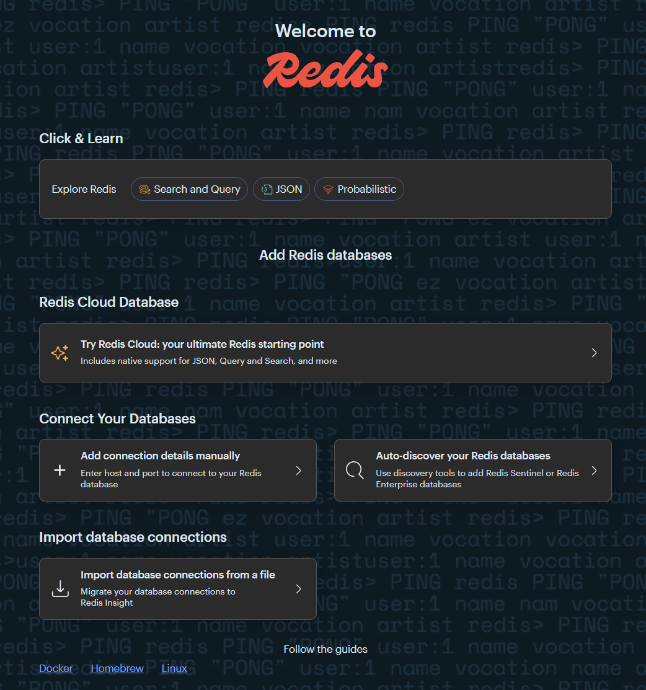

# <p align="center">Redis</p>

To get more information refer to [https://redis.io](https://redis.io).

# Use Case

List of use cases for Redis
[https://redis.io/docs/latest/develop/interact/search-and-query/query-use-cases/](https://redis.io/docs/latest/develop/interact/search-and-query/query-use-cases/).

* Application search and external secondary index
* Secondary index for Redis data
* Geo-distributed search
* Unified search
* Analytics
* Ephemeral search (retail)
* Real-time inventory (retail)
* Real-time conversation analysis (telecom)
* Research portal (academia)

# Setup

## Prerequisites

* [Docker](https://www.docker.com/)
* [Kubernetes](https://kubernetes.io/)

## Installation Redis on Docker

### Docker Compose File

[docker-compose.yml](docker-compose.yml)

```yaml
# docker-compose.yml
version: "3.8"

services:
  redis:
    image: redis:latest
    container_name: redis
    hostname: redis
    restart: always
    ports:
      - "6379:6379"
  redisinsight:
    image: redislabs/redisinsight:latest
    container_name: redisinsight
    hostname: redisinsight
    restart: always
    ports:
      - "5540:5540"

```

### Apply Docker Compose File

Execute the command mentioned in the below to create MongoDB container.

```shell
docker compose --file docker-compose.yml --project-name redis up -d --build
```

### Redisinsight

In order to connect to redis by Redisinsight through the web browser
open [http://localhost:5540](http://localhost:5540).

<p align="center">



</p>

Then select "Add connection details manually" and enter redis as host and 6379 for port. Also, you can enter an alias
for database.

### Remove From Docker

More commands to remove whatever you created.

```shell
docker rm redis --force
docker rm redisinsight --force
docker image rm redis:latest
docker image rm redislabs/redisinsight:latest
```

## Install Redis on Kubernetes

Create the following files for installing Redis.

### Redis Kube Files

[redis-deployment.yml](./kube/redis-deployment.yml)

```yaml
# redis-deployment.yml
apiVersion: apps/v1
kind: Deployment
metadata:
  name: redis
spec:
  replicas: 1
  selector:
    matchLabels:
      app: redis
  template:
    metadata:
      labels:
        app: redis
    spec:
      containers:
        - name: redis
          image: redis:latest
          ports:
            - containerPort: 6379
```

[redis-service.yml](./kube/redis-service.yml)

```yaml
# redis-service.yml
apiVersion: v1
kind: Service
metadata:
  name: redis
spec:
  selector:
    app: redis
  ports:
    - protocol: TCP
      port: 6379
      targetPort: 6379
```

### Redisinsight Kube Files

[redisinsight-deployment.yml](./kube/redisinsight-deployment.yml)

```yaml
# redisinsight-deployment.yml
apiVersion: apps/v1
kind: Deployment
metadata:
  name: redisinsight
spec:
  replicas: 1
  selector:
    matchLabels:
      app: redisinsight
  template:
    metadata:
      labels:
        app: redisinsight
    spec:
      containers:
        - name: redisinsight
          image: redislabs/redisinsight:latest
          ports:
            - containerPort: 5540
```

[redisinsight-service.yml](./kube/redisinsight-service.yml)

```yaml
# redisinsight-service.yml
apiVersion: v1
kind: Service
metadata:
  name: redisinsight
spec:
  selector:
    app: redisinsight
  ports:
    - protocol: TCP
      port: 5540
      targetPort: 5540
```

### Apply Kube Files

You can apply Kubernetes files using the following commands.

```shell
kubectl apply -f ./kube/redis-deployment.yml
kubectl apply -f ./kube/redis-service.yml
kubectl apply -f ./kube/redisinsight-deployment.yml
kubectl apply -f ./kube/redisinsight-service.yml
```

To check status, use `kubectl get all` command.

<p align="justify">

In order to connect to Redis and Redisinsight from localhost use the following command.

```shell
kubectl port-forward service/redis 6379:6379
kubectl port-forward service/redisinsight 5540:5540
```

### Remove From Kubernetes

More command to delete everything you created and deployed to Kubernetes.

```shell
kubectl delete all --all
```

## Redis Shell

Follow the below command to connect to dockerized MongoDB instance.

```shell
# Host installation
redis-cli -h host-name/host-IP -p 6379
# Dockerized installation
docker exec -it redis redis-cli -h host-name/host-IP -p 6379

# Example of dockerized installation
docker exec -it redis redis-cli -h 127.0.0.1 -p 6379
docker exec -it redis redis-cli -h localhost -p 6379
docker exec -it redis redis-cli -h redis -p 6379

docker exec -it redis bash -c "redis-cli -h $(hostname) -p 6379"
```

# Queries

## Basic Queries
### SET and GET
```redis
set key value
get key

# Example
set name tutorial
get name
```

### HSET and GSET
```redis
HSET person:1 name John surname Doe email johndoe@email.com
HGETALL person:1
HGET person:1 name
```

### List
```redis
LPUSH names John William James
LRANGE names 0 2
```

## Channel Publish Subscribe

### Subscriber
Open a terminal then execute the following command one by one.
```shell
subscribe channel

# Example
docker exec -it redis bash -c "redis-cli -h $(hostname) -p 6379 subscribe test-channel"
```

### Publisher

```shell
publish channel message

# Example
docker exec -it redis bash -c "redis-cli -h $(hostname) -p 6379"
publish test-channel "Hello World!"
```

## Stream

```redis
XREAD BLOCK 0 STREAMS persons $
```

```redis
XADD persons * name John surname Doe email johndoe@email.com
```

```redis
XRANGE persons - +
```

### Implement Stream Listener

```shell
#!/bin/bash

read -p "Enter the Redis stream name: " STREAM_NAME
LAST_ID="$"

while true; do
    NEW_MESSAGES=$(redis-cli XREAD BLOCK 0 STREAMS $STREAM_NAME $LAST_ID)
    echo "$NEW_MESSAGES"
done
```

```shell
docker cp  /path/to/host-file container-name:/path/to/contaner-file

# Example
docker cp ./stream-reader.sh redis:/stream-reader.sh
docker exec -it redis bash /stream-reader.sh
```

# Make File

[Makefile](Makefile)

```makefile
docker-deploy:
	docker compose --file docker-compose.yml --project-name redis up -d

docker-rebuild-deploy:
	docker compose --file docker-compose.yml --project-name redis up --build -d

docker-remove-container:
	docker rm redis --force
	docker rm redisinsight --force
	
docker-remove-image:
	docker image rm redis:latest
	docker image rm redislabs/redisinsight:latest
	
kube-deploy:
	kubectl apply -f ./kube/redis-deployment.yml
	kubectl apply -f ./kube/redis-service.yml
	kubectl apply -f ./kube/redisinsight-deployment.yml
	kubectl apply -f ./kube/redisinsight-service.yml
	
kube-remove:
	kubectl delete all --all

kube-port-forward-db:
	kubectl port-forward service/redis 6379:6379

kube-port-forward-web:
	kubectl port-forward service/redisinsight 5540:5540
	
```

#

**<p align="center"> [Top](#redis) </p>**